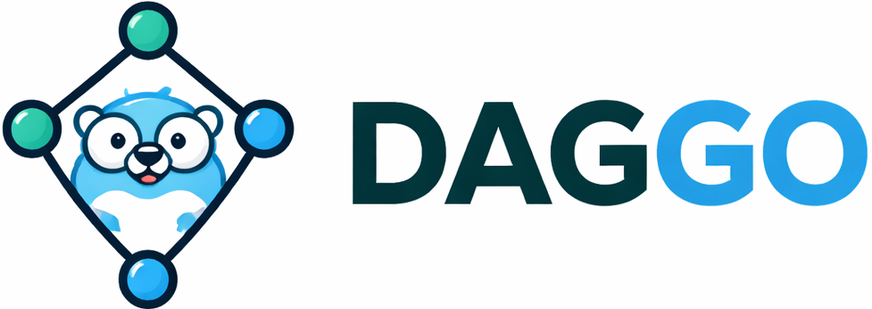
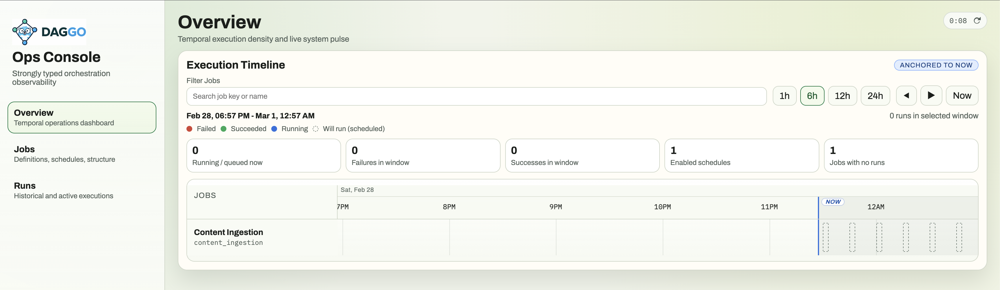
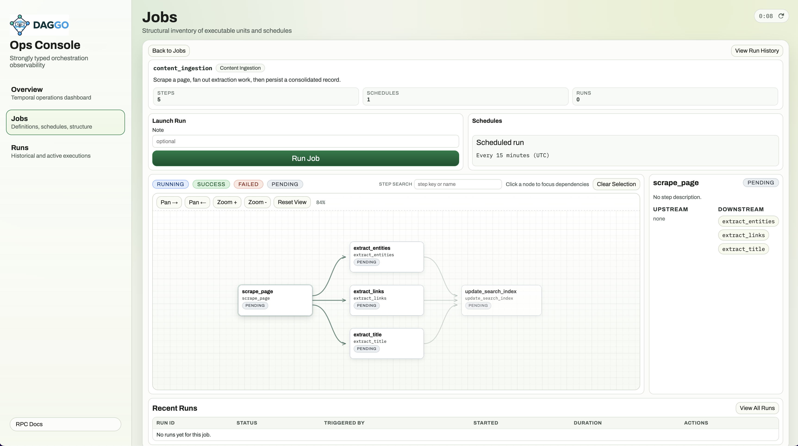
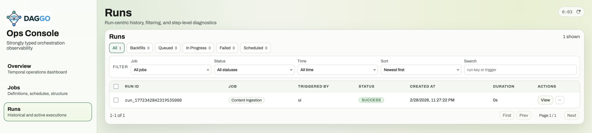

# DAGGO

<p align="center">
  
</p>

[](https://github.com/swetjen/daggo/actions/workflows/ci.yml)
[](https://github.com/swetjen/daggo/releases)

DAGGO is a Go-native workflow orchestrator for teams that want to define jobs in Go, ship a single binary, and still get an admin UI, scheduling, run history, and step-level diagnostics out of the box.

## Admin UI

The embedded UI is intended to be usable immediately in an imported app: overview timeline, job graph, and run history in one place.



The job detail view shows the DAG shape, an `Enabled` scheduling toggle, and tabbed `Overview`/`Runs` panels with inline run launch.



The runs view gives a run-centric history with filtering and drill-in diagnostics.



## What You Get

- Typed DAG authoring with build-time validation.
- Sqlite by default with Postgres also supported.
- Embedded web admin UI served by the same Go process.
- RPC API with generated client support.
- Background scheduling and async run execution.
- Internal worker bootstrapping handled by DAGGO, so importing apps do not need to implement private subprocess commands.

## Planned Work

- Robust worker pool implementation and coordination from the DAGGO admin.
- Support for data partitions, assets, and management.
- Migration support for coming from Dagster and similar tools.
- Reference integrations with BigQuery, Databricks, and similar platforms.

## Install

```bash
go get github.com/swetjen/daggo
```

## Quick Start

```go
package main

import (
	"context"
	"log"

	"github.com/swetjen/daggo"
	"myapp/jobs"
	"myapp/ops"
	"myapp/resources"
)

func main() {
	cfg := daggo.DefaultConfig()
	cfg.Admin.Port = "8080"
	cfg.Database.SQLite.Path = "/tmp/daggo.sqlite"

	deps := resources.NewDeps()
	myOps := ops.NewMyOps(deps)
	myJobs := jobs.ContentIngestionJob(myOps)

	if err := daggo.Run(context.Background(), cfg, myJobs); err != nil {
		log.Fatal(err)
	}
}
```

`jobs.ContentIngestionJob(...)` mounts named ops onto the DAG definition:

```go
func ContentIngestionJob(myOps *ops.MyOps) dag.JobDefinition {
	scrapePage := dag.Op[dag.NoInput, ops.ScrapePageOutput]("scrape_page", myOps.ScrapePageOp)
	extractTitle := dag.Op[ops.ExtractTitleInput, ops.ExtractTitleOutput]("extract_title", myOps.ExtractTitleOp)
	extractEntities := dag.Op[ops.ExtractEntitiesInput, ops.ExtractEntitiesOutput]("extract_entities", myOps.ExtractEntitiesOp)
	extractLinks := dag.Op[ops.ExtractLinksInput, ops.ExtractLinksOutput]("extract_links", myOps.ExtractLinksOp)
	upsertIndex := dag.Op[ops.UpsertIndexInput, ops.UpsertIndexOutput]("upsert_index", myOps.UpsertIndexOp)

	return dag.NewJob("content_ingestion").
		Add(scrapePage, extractTitle, extractEntities, extractLinks, upsertIndex).
		AddSchedule(dag.ScheduleDefinition{
			CronExpr: "*/15 * * * *",
			Timezone: "UTC",
			Enabled:  true,
		}).
		MustBuild()
}
```

Each op follows a standard Go function shape:

1. Input type
2. Output type
3. Named Go function or method

```go
type AnalyzeTextInput struct {
	Page ScrapePageOutput
}

type AnalyzeTextOutput struct {
	VowelsCount     int
	ConsonantsCount int
}

func (o *MyOps) AnalyzeTextOp(ctx context.Context, in AnalyzeTextInput) (AnalyzeTextOutput, error) {
	if err := ctx.Err(); err != nil {
		return AnalyzeTextOutput{}, err
	}

	body := in.Page.Body

	// Naively strip HTML tags.
	// Good enough for demo purposes, not production-grade parsing.
	tagRegex := regexp.MustCompile(`<[^>]*>`)
	text := tagRegex.ReplaceAllString(body, "")

	vowels := 0
	consonants := 0

	for _, r := range strings.ToLower(text) {
		if r >= 'a' && r <= 'z' {
			switch r {
			case 'a', 'e', 'i', 'o', 'u':
				vowels++
			default:
				consonants++
			}
		}
	}

	return AnalyzeTextOutput{
		VowelsCount:     vowels,
		ConsonantsCount: consonants,
	}, nil
}
```

See [examples/content_ingestion/main.go](examples/content_ingestion/main.go), [examples/content_ingestion/jobs/content_ingestion.go](examples/content_ingestion/jobs/content_ingestion.go), [examples/content_ingestion/ops/content_ops.go](examples/content_ingestion/ops/content_ops.go), and [examples/content_ingestion/resources/deps.go](examples/content_ingestion/resources/deps.go) for the full example.

## Startup Flow

Calling `daggo.Run(...)` gives new users a working runtime immediately:

1. Opens the configured database.
2. Applies bundled migrations automatically.
3. Syncs registered jobs into DAGGO metadata tables.
4. Serves the embedded admin UI and RPC docs.
5. Starts the scheduler and async executor.
6. Handles DAGGO's internal worker subprocess command inside the same application binary.

Current schedules are derived from the jobs you register at startup. DAGGO does not persist future schedule definitions in the database; it persists scheduler bookkeeping and historical runs.

If you only want the RPC surface, set `cfg.DisableUI = true`. DAGGO will continue serving `/rpc/` and `/rpc/docs/`, while `/` will no longer expose the admin UI.

## Runner Model

By default, DAGGO executes runs in `subprocess` mode. When a run starts, DAGGO launches a separate worker PID from the same application binary and that worker owns the run lifecycle.

Relevant execution settings:

- `cfg.Execution.Mode`
- `cfg.Execution.MaxConcurrentRuns`
- `cfg.Execution.MaxConcurrentSteps`

Because the active run lives in a separate worker process, the web server can restart or roll forward independently without tying run execution to a request-serving goroutine. DAGGO is also designed for deploy-drain coordination so new web code can come up without immediately breaking active workers. We plan to add additional daemon and runner configurations later.

If you want to mount DAGGO into a larger server instead of letting it own the listener, use `daggo.Open(...)` and attach `app.Handler()` wherever you need it.

## Recommended Project Structure

For importing apps, the cleanest layout is usually:

```text
myapp/
  main.go
  jobs/
    content_ingestion.go
    customer_sync.go
  ops/
    content_ops.go
    customer_ops.go
  resources/
    deps.go
    crud.go
    openai.go
    playwright.go
    gemini.go
    s3.go
```

- Put job definitions in `jobs/`.
- Put concrete operational code in `ops/`.
- Put shared clients and app dependencies in `resources/`.
- Pass `resources.Deps` into an ops struct and bind DAGGO steps to named methods on that struct.

That keeps job wiring declarative while keeping dependency handling explicit and testable.

```go
package resources

import (
	"context"

	"github.com/openai/openai-go/v3"
	"myapp/db"
	"github.com/swetjen/daggo/resources/ollama"
	playwrightresource "github.com/swetjen/daggo/resources/playwright"
	"github.com/swetjen/daggo/resources/s3resource"
	"google.golang.org/genai"
)

type Deps struct {
	CRUD *db.Queries

	Playwright *playwrightresource.RemoteResource
	S3         *s3resource.Resource
	Gemini     *genai.Client
	OpenAI     *openai.Client
	Ollama     *ollama.Resource

	Scraper func(ctx context.Context, targetURL string) (ScrapeResult, error)
}
```

Then mount those dependencies onto an ops struct:

```go
package ops

type MyOps struct {
	deps resources.Deps
}

func NewMyOps(deps resources.Deps) *MyOps {
	return &MyOps{deps: deps}
}

func (o *MyOps) ScrapePageOp(ctx context.Context, input dag.NoInput) (ScrapePageOutput, error) {
	if err := ctx.Err(); err != nil {
		return ScrapePageOutput{}, err
	}

	// Run some processing on the input.
	result, err := o.deps.Scraper(ctx, o.scrapeTargetURL(input))
	if err != nil {
		return ScrapePageOutput{}, err
	}

	return ScrapePageOutput{
		Body:       result.Body,
		StatusCode: result.StatusCode,
	}, nil
}

func (o *MyOps) scrapeTargetURL(dag.NoInput) string {
	return "https://example.com"
}

type ScrapePageOutput struct {
	Body       string
	StatusCode int
}
```

Then your `jobs/` package can focus on graph composition:

```go
func ContentIngestionJob(myOps *ops.MyOps) dag.JobDefinition {
	scrape := dag.Op[dag.NoInput, ops.ScrapePageOutput]("scrape_page", myOps.ScrapePageOp)
	return dag.NewJob("content_ingestion").Add(scrape).MustBuild()
}
```

## Configuration

Start from `daggo.DefaultConfig()` and override what you need:

```go
cfg := daggo.DefaultConfig()
cfg.Admin.Port = "8080"
cfg.Admin.SecretKey = "replace-me"
cfg.DisableUI = false
cfg.Database.SQLite.Path = "/tmp/daggo.sqlite"
```

Available config areas:

- `cfg.Admin.Port`: web admin / RPC listen port.
- `cfg.Admin.SecretKey`: optional bearer secret for `/rpc/` and `/rpc/docs/`.
- `cfg.DisableUI`: disable the embedded admin UI while keeping RPC/docs enabled.
- `cfg.Database`: database driver and connection settings.
- `cfg.Execution`: queue size, execution mode, run concurrency, step concurrency.
- `cfg.Scheduler`: scheduler enablement and tick controls.
- `cfg.Deploy`: deploy-drain lock settings.

Environment-based startup is still available through `daggo.LoadConfigFromEnv()` for the repo's sample binary and local development.

### Database Modes

SQLite is the default and is fully implemented today.

```go
cfg := daggo.DefaultConfig()
cfg.Database.SQLite.Path = "/tmp/daggo.sqlite"
```

PostgreSQL is opt-in and only activates when the driver is explicitly set to `postgres`.

```go
cfg := daggo.DefaultConfig()
cfg.Database.Driver = daggo.DatabaseDriverPostgres
cfg.Database.Postgres.Host = "db.internal"
cfg.Database.Postgres.Port = 5432
cfg.Database.Postgres.User = "daggo"
cfg.Database.Postgres.Password = "secret"
cfg.Database.Postgres.Database = "platform"
cfg.Database.Postgres.Schema = "my_project"
cfg.Database.Postgres.SSLMode = "require"
```

At startup, DAGGO will:

1. connect to the configured PostgreSQL database
2. create the configured schema if it does not exist
3. set `search_path` so DAGGO uses that schema
4. run embedded up-migrations automatically
5. use PostgreSQL for jobs, runs, scheduler state, and events

The PostgreSQL runtime details and remaining limitations are documented in [docs/POSTGRES_RUNTIME_SPEC.md](docs/POSTGRES_RUNTIME_SPEC.md).

### RPC Guard

If you want to lock down the DAGGO control plane, configure a secret key:

```go
cfg := daggo.DefaultConfig()
cfg.Admin.SecretKey = "replace-me"
cfg.DisableUI = true
```

With a secret configured, DAGGO requires `Authorization: Bearer <secret>` on `/rpc/` and `/rpc/docs/`.

Generated clients pass the same value through their auth option:

```ts
const client = createClient("http://localhost:8000")
await client.jobs.JobsGetMany({ limit: 50, offset: 0 }, { auth: "replace-me" })
```

The embedded UI is not authenticated yet. For locked-down deployments today, run DAGGO with `cfg.DisableUI = true`.

### Schedules

Schedules are declarative job config, not persisted DB records.

- Current schedules come from the in-memory jobs you register at startup.
- DAGGO persists only scheduler state and dedupe claims for active schedules.
- Removing a schedule from code clears that scheduler bookkeeping but preserves historical runs.
- `dag.ScheduleDefinition.Key` is optional; if omitted, DAGGO derives a stable readable key from the cron expression.

#### PostgreSQL via Environment

PostgreSQL is not auto-detected from env vars alone. Set the driver explicitly:

```bash
export DAGGO_DATABASE_DRIVER=postgres
export DAGGO_POSTGRES_HOST=db.internal
export DAGGO_POSTGRES_PORT=5432
export DAGGO_POSTGRES_USER=daggo
export DAGGO_POSTGRES_PASSWORD=secret
export DAGGO_POSTGRES_DATABASE=platform
export DAGGO_POSTGRES_SCHEMA=my_project
export DAGGO_POSTGRES_SSLMODE=require

go run ./cmd/api
```

## Local Development

1. Install prerequisites: Go `1.25+`, `bun`, `make`.
2. Copy the env template:

```bash
cp .env.example .env
```

3. Generate SQL, SDK, and frontend assets:

```bash
make gen-all
```

4. Start the sample binary:

```bash
go run ./cmd/api
```

5. Open:

- UI: `http://localhost:8000/`
- RPC docs: `http://localhost:8000/rpc/docs/`
- OpenAPI: `http://localhost:8000/rpc/openapi.json`

## Key Commands

- `make gen`: regenerate sqlc output.
- `make gen-sdk`: regenerate RPC clients.
- `make gen-web`: rebuild frontend assets.
- `make gen-all`: run every generation step.
- `go test ./...`: run the Go test suite.

## Documentation

- Usage guide: [docs/USAGE_GUIDE.md](docs/USAGE_GUIDE.md)
- Coming from Dagster: [docs/COMING_FROM_DAGSTER.md](docs/COMING_FROM_DAGSTER.md)
- PostgreSQL runtime plan: [docs/POSTGRES_RUNTIME_SPEC.md](docs/POSTGRES_RUNTIME_SPEC.md)
- Deploy-drain behavior: [docs/WILL_DEPLOY_DRAIN_LOCK_PLAN.md](docs/WILL_DEPLOY_DRAIN_LOCK_PLAN.md)
