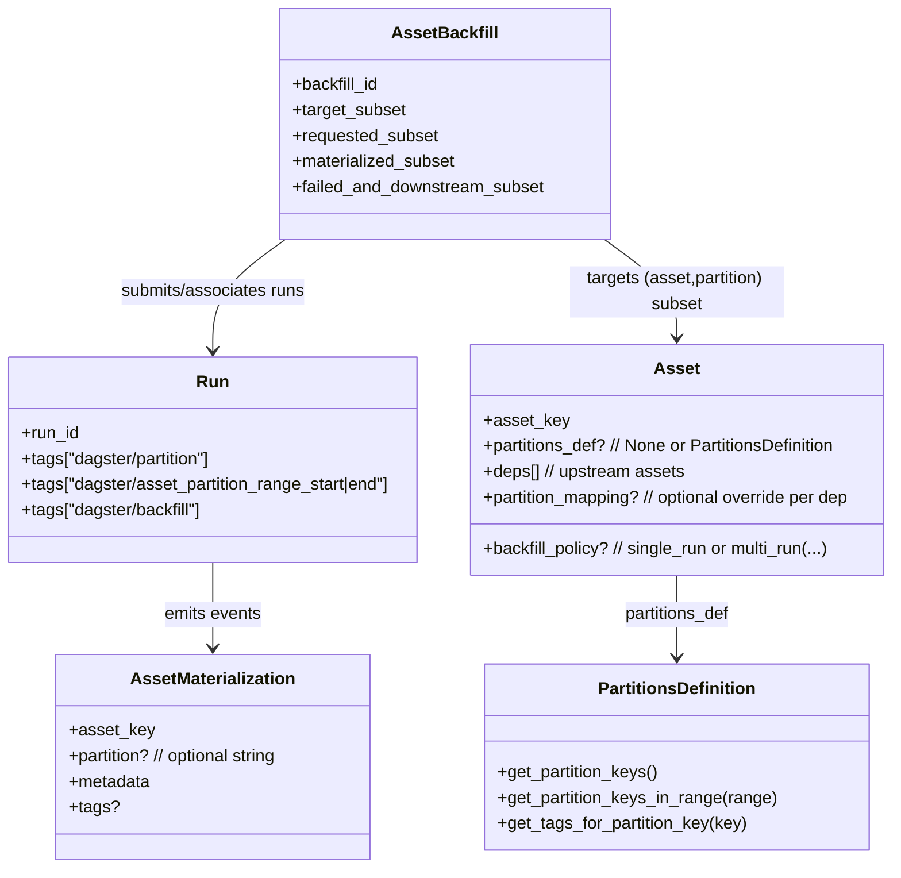

# Specification Blueprint for Dagster Partitions and Assets

## Executive summary

This report specifies a pragmatic, testable contract for how Dagster “Partitions” and “Assets” should behave in user-facing workflows and in an agent-driven automation layer—especially around backfills, partial backfills, re-materializations, and the precise way a *run* is interpreted as producing asset materializations “for” a given partition (single key vs a key range). Dagster’s official documentation defines the primary user model (partition types, how partitioned assets are materialized, and how backfills are launched), while the core repository code clarifies the canonical machine-level representations (partition tags, multi-partition key encoding, partition-range validation rules, and asset-backfill tracking state). citeturn28search0turn20view1turn16view0turn11view0turn10view0

Key points the specification treats as foundational:
- **A partitioned materialization is defined by an `(asset_key, partition_key)` pair**, recorded as an asset event (e.g., materialization/observation) with an optional `partition` field. citeturn30view0
- **Runs target partitions via run tags**: a single partition uses `dagster/partition`, and range-style targeting uses `dagster/asset_partition_range_start` / `dagster/asset_partition_range_end` (with backfill association via `dagster/backfill`). citeturn11view0
- **Default backfills are multi-run** (N partitions → N runs), while **single-run backfills** require an explicit `backfill_policy` and code/IO-manager support to operate on a *range* of partitions. citeturn20view1turn25search1turn22search3
- **Partition mappings** formally define partition-level lineage across assets and return both valid upstream partitions *and* “required but nonexistent” partitions that must be surfaced as actionable dependency gaps. citeturn17view0turn18view1

Open items explicitly left unspecified (to be decided by the implementer): retention/archival, exact external API shapes for the “agent,” and organization-specific authorization/RBAC rules. citeturn25search21turn11view0

## Conceptual model of partitioned assets, runs, and backfills

### Canonical partition and asset primitives

A **PartitionsDefinition** is the abstract type that defines a set of partition keys attachable to an asset or job and provides:
- enumeration (`get_partition_keys`)
- subset/range operations (`get_partition_keys_in_range`)
- validation (errors on unknown partition keys / invalid ranges) citeturn16view0

In code, a partition key range is expressed as `PartitionKeyRange(start, end)` and `PartitionsDefinition.get_partition_keys_in_range` validates both endpoints and returns an inclusive slice across the ordered key list (or raises if either endpoint does not exist). citeturn16view0turn7search3

Dagster’s docs describe four major partitioning styles and recommend limiting partitions per asset to avoid UI performance degradation (docs mention ≤100k partitions per asset, and other official guidance recommends practical lower limits in certain contexts, such as sensor-driven dynamic partition churn). citeturn28search0turn28search1turn15view0

### Partition types and how keys are encoded

Time-window partitions are based on `TimeWindowPartitionsDefinition` and its subclasses (Hourly/Daily/Weekly/Monthly), with support for timezone-aware formatting and `end_offset` to extend partition visibility beyond “current time” in controlled ways. citeturn15view0

Static partitions define a fixed list of keys and expose them directly via `get_partition_keys` (with validity constraints and partition-count behavior meant to keep counts consistent in UI). citeturn14view0

Dynamic partitions allow keys to be added/removed at runtime (e.g., by sensors) and require access to a `DynamicPartitionsStore` (typically a `DagsterInstance`) to resolve keys; missing instance plumbing produces a hard failure with a diagnostic message. citeturn13view0turn28search1

Multi-dimensional partitions are implemented by **MultiPartitionsDefinition**, which (in current core code) supports **exactly two** dimensions and defines the partition set as the **cross-product** of dimension keys. Multi-partition keys are represented as a string with a `|` delimiter, with dimension ordering normalized by sorting dimension names to ensure stable string representations. citeturn9view0turn12view0turn19view2

### How runs “produce” partitioned assets

Dagster distinguishes “the partition selection of the run” from “what the asset code does internally”:

- A typical partitioned materialization launches **one run per partition**; the UI documentation explicitly states that when materializing a partitioned asset you choose partitions and Dagster launches a run for each partition, and that the daemon must be running to queue multiple runs if more than one partition is selected. citeturn20view0
- For assets that implement single-run backfill semantics, a single run may correspond to a **range of partitions**, and user code must use `context.partition_keys`, `context.partition_key_range`, or `context.partition_time_window` rather than `context.partition_key` (which errors for range runs). citeturn20view1turn18view4
- IO manager semantics are the bridge from “run targets partition(s)” to “data is stored per-partition”: for a partitioned asset, each `handle_output` invocation typically overwrites a single partition, while `load_input` may load one or more partitions (notably when partition mappings map one downstream partition to many upstream partitions). citeturn21view0turn18view1turn17view0

Run tagging is the machine-readable interface by which orchestration (including agent-driven orchestration) declares what partition(s) a run targets: `dagster/partition` for single partition, multi-dimension tags under `dagster/partition/<dimension>`, and explicit range tags for range-based execution. citeturn11view0turn12view0turn16view0

### Backfills as a first-class state machine

Dagster docs define backfilling as executing partitions that are missing or need updating, and explicitly support backfills for “each partition or a subset of partitions.” citeturn20view1

At the implementation level, asset backfills are tracked via a serialized state object (`AssetBackfillData`) that maintains:
- a target subset,
- a requested subset,
- a materialized subset,
- a failed-and-downstream subset,
- and completion predicates based on whether targeted partitions are accounted for and whether runs are finished. citeturn10view0

This “subset accounting” is central to specifying correct behavior for partial backfills, retries, and re-materializations.

### Diagrams

This conceptual structure corresponds to documented behavior (assets + partitions + materializations) and repository code artifacts (run tags, backfill tracking subsets, and partition-key encoding). citeturn20view0turn11view0turn10view0turn30view0turn9view0

## User stories

The following user stories are organized to cover interactive users (data engineers, SREs), automated systems, and API consumers, while remaining implementable in an agent-driven v1.

| ID | Actor | Goal | Benefit |
|---|---|---|---|
| US-A | Data engineer (interactive) | Define partitioned assets and materialize specific partitions (including re-materialization) | Incremental processing + faster iteration; deterministic reruns per partition citeturn28search0turn20view0turn21view0 |
| US-B | Data engineer (interactive) | Execute backfills over historical partitions, optionally as single-run backfills | Efficient rebuilding of history; reduced overhead when compute engine is externalized citeturn20view1turn25search1turn18view4 |
| US-C | SRE / platform operator | Enforce safe concurrency, monitor progress, and diagnose failures for large backfills | Reliability and predictable resource usage in production deployments citeturn20view0turn25search4turn10view0turn11view0 |
| US-D | Automated scheduler/sensor system | Add/remove dynamic partitions and emit run requests for (possibly many) partitions | Automate processing of newly discovered entities/files; avoid manual UI operations citeturn13view0turn20view0turn28search1 |
| US-E | API consumer (internal tooling / agent) | Programmatically select partitions (single/range/subset), launch backfills, and query status | Build higher-level orchestration/UX and integrate Dagster into broader platforms citeturn11view0turn10view0turn16view0turn20view1 |
| US-F | Governance / lineage consumer | Understand partition-level lineage: for a given asset partition, identify upstream partitions and gaps | Trustworthy debugging and impact analysis at partition granularity citeturn17view0turn18view1turn30view0 |

## Functional requirements and acceptance criteria

This section defines functional requirements (FRs) mapped to the user stories above. Each FR includes: inputs/outputs, error cases, performance expectations, security/permissions, observability, and lineage expectations—followed by pass/fail acceptance criteria.

### Requirement inventory and mapping

| FR | Summary | Applies to |
|---|---|---|
| FR-1 | Partition definition introspection and key enumeration | US-A, US-D, US-E |
| FR-2 | Partition selection validation: single key, contiguous range, explicit subset | US-A, US-B, US-D, US-E |
| FR-3 | Run targeting semantics: how partition tags/range tags define “what the run produces” | US-A, US-B, US-E, US-F |
| FR-4 | Materialization of partitioned assets: “one run per partition” baseline | US-A, US-C |
| FR-5 | Backfill launch semantics: multi-run default, single-run via BackfillPolicy | US-B, US-C, US-E |
| FR-6 | Single-run backfill execution contract for assets and IO managers | US-B, US-C, US-E |
| FR-7 | Multi-dimensional partition contract (MultiPartitionsDefinition + MultiPartitionKey tags) | US-A, US-B, US-D, US-E, US-F |
| FR-8 | Partition mappings and partition-level lineage resolution | US-A, US-F, US-E |
| FR-9 | Backfill progress tracking and completion criteria | US-B, US-C, US-E |
| FR-10 | Partial backfills (subset selection) and re-materializations | US-A, US-B, US-C, US-E |
| FR-11 | Performance and scalability guardrails (partition count, batching, concurrency) | US-C, US-D, US-E |
| FR-12 | Security, permissions, and auditability (agent + Dagster tags) | US-C, US-E |

### FR-1 Partition definition introspection and key enumeration

**Statement**  
The system (agent + any client layer) must treat Dagster’s partitions definitions as the source of truth for partition key sets, including support for enumeration and pagination where available. citeturn16view0turn18view3turn9view0turn13view0

**Inputs**  
- A reference to an asset’s `PartitionsDefinition` (e.g., TimeWindow, Static, Dynamic, Multi). citeturn28search0turn16view0turn15view0turn14view0turn13view0  
- Optional `current_time` (for time-based partitions). citeturn15view0turn16view0  
- Optional `dynamic_partitions_store` for dynamic dimensions (usually `context.instance`). citeturn13view0turn16view0  

**Outputs**  
- Deterministic list of partition keys (or paginated keys for very large sets). citeturn16view0turn9view0turn13view0  

**Error cases**  
- Dynamic partitions without an available instance/dynamic store must fail with an actionable error. citeturn13view0  
- MultiPartitionsDefinition must reject unsupported dimension types and require exactly two dimensions. citeturn9view0  

**Performance expectations**  
- Enumeration must be treated as potentially expensive and should use pagination when supported (`get_paginated_partition_keys` exists on the abstract interface and is implemented by several definitions). citeturn16view0turn9view0turn13view0  

**Security/permissions** (open)  
- If the agent runs in a multi-tenant context, access to enumerate dynamic partitions may need to be scoped; Dagster OSS does not define RBAC in the core partition interface, so this remains an integration concern. citeturn13view0turn11view0  

**Observability**  
- Enumerations used for operational decisions (launch/backfill) must be logged with: partitions_def type, count, and whether pagination was used. (Exact logging mechanism open.) citeturn20view0turn28search1  

**Lineage**  
- Enumeration itself does not create lineage, but consistent key ordering is a prerequisite for range semantics used by backfills and partition mappings. citeturn16view0turn17view0  

**Acceptance criteria**  
- **AC-1.1 (static enumeration)**: Given a `StaticPartitionsDefinition(["us","eu"])`, `get_partition_keys()` returns exactly `["us","eu"]` (order preserved by underlying definition). Pass if lists match exactly; fail otherwise. citeturn14view0turn28search0  
- **AC-1.2 (dynamic missing store)**: Given a `DynamicPartitionsDefinition(name="regions")` and no dynamic store, `get_partition_keys()` fails with an error indicating instance/store is not available. Pass if failure occurs and the error message indicates missing instance plumbing; fail if silent or returns incorrect keys. citeturn13view0  
- **AC-1.3 (multi-dimension constraint)**: Creating `MultiPartitionsDefinition` with ≠2 dimensions fails. Pass if it raises; fail if accepted. citeturn9view0turn19view2  

### FR-2 Partition selection validation: single key, contiguous range, explicit subset

**Statement**  
The agent must represent partition selection in three canonical forms:
1) single key  
2) contiguous key range (`PartitionKeyRange`)  
3) explicit subset (set/list of keys)

and must validate selections against the asset’s `PartitionsDefinition` before launching runs/backfills. citeturn16view0turn7search3turn20view1

**Inputs**  
- partitions_def + selection form (single/range/subset). citeturn16view0turn20view1  

**Outputs**  
- normalized “selection object” used to drive run request generation (exact agent API shape open). citeturn11view0turn16view0  

**Error cases**  
- Range endpoints absent → `DagsterInvalidInvocationError` per core range validation behavior. citeturn16view0  
- “Range” for definitions where “contiguity” is ambiguous or unstable (notably dynamic partitions) must either:
  - be rejected, or
  - be translated into explicit subsets or multiple small ranges after stable ordering is established. (This is an explicit v1 design choice; see open decisions.) citeturn16view0turn13view0turn28search1  

**Performance expectations**  
- Validation should avoid full enumeration for extremely large sets where possible (open; Dagster’s base `has_partition_key` is defined as membership in the enumerated list unless overridden). citeturn16view0turn9view0  

**Security/permissions** (open)  
- Partition selection requests may be user-supplied; sanitize/validate to prevent tag injection or excessive-resource requests. Tag semantics are standardized under `dagster/` prefix. citeturn11view0  

**Observability**  
- Validation failures must be surfaced as user-actionable errors stating: invalid key(s), definition type, and recommended corrective action (e.g., “add dynamic partition first”). citeturn13view0turn16view0turn28search1  

**Lineage**  
- Valid selection is a prerequisite to any lineage computations for a partitioned run or backfill. citeturn17view0turn30view0  

**Acceptance criteria**  
- **AC-2.1 (range validity)**: For partitions `["a","b","c","d"]`, selecting range `start="a", end="c"` returns `["a","b","c"]`. Pass if inclusive slice matches; fail otherwise. citeturn16view0turn18view3  
- **AC-2.2 (unknown endpoint fails)**: For the same definition, selecting `start="a", end="z"` fails with an error naming nonexistent keys. Pass if failure + key(s) included; fail otherwise. citeturn16view0  
- **AC-2.3 (subset validity)**: For any subset selection, every key must exist under `has_partition_key`. Pass if invalid keys are rejected; fail if runs are launched with unknown keys. citeturn16view0turn13view0  

### FR-3 Run targeting semantics: interpreting tags and context as “what the run produces”

**Statement**  
The system must define an unambiguous interpretation for how a run targets partitions, using Dagster’s tag and context semantics:

- **Single-partition run**: run carries `dagster/partition=<key>` and asset context exposes `partition_key` (and `partition_key_range` with identical start=end). citeturn11view0turn18view4turn16view0  
- **Range-based run**: run carries `dagster/asset_partition_range_start` and `dagster/asset_partition_range_end`; asset context exposes `partition_key_range` and `partition_keys`, and accessing `partition_key` must error. citeturn11view0turn18view4  

**Inputs**  
- run tags; partitions_def (needed to expand ranges into concrete keys). citeturn11view0turn16view0  

**Outputs**  
- For each materialized asset, a set of `(asset_key, partition_key)` pairs considered “targeted by this run.” citeturn30view0turn10view0  

**Error cases**  
- Single-run backfill with IO manager expecting `asset_partition_key` may fail (e.g., the default filesystem IO manager historically errored on partition ranges because it attempted to include a single partition key in a path). This must be treated as a configuration/integration error, not a silent success. citeturn22search3turn21view0  

**Performance expectations**  
- Expanding a wide range into all keys can be expensive; must be bounded by operational controls (see FR-11) and ideally paginated/streamed when possible. citeturn16view0turn10view0  

**Security/permissions**  
- System tags are distinguished from user tags. The agent must not allow arbitrary user override of system tags that would misrepresent partition targeting (exact policy open). citeturn11view0  

**Observability**  
- The agent must log the *resolved* partition keys (count + boundary keys) and the *declared* tag form (single vs range), because the difference is operationally significant. citeturn18view4turn20view1turn10view0  

**Lineage**  
- Partition-level lineage uses the resolved `(asset_key, partition_key)` set as the node set for dependency evaluation. citeturn17view0turn18view1  

**Acceptance criteria**  
- **AC-3.1 (single partition tags)**: A run with `dagster/partition="2024-01-01"` must resolve to exactly one targeted partition key. Pass if exactly one; fail if more/none. citeturn11view0turn18view4  
- **AC-3.2 (range tags)**: A run with range tags must resolve to the inclusive key list returned by `get_partition_keys_in_range`. Pass if match; fail otherwise. citeturn11view0turn16view0  
- **AC-3.3 (context contract)**: In a range-based run, accessing `context.partition_key` errors. Pass if error is raised; fail if it returns a misleading value. citeturn18view4  

### FR-4 Materialization of partitioned assets: “one run per partition” baseline behavior

**Statement**  
Absent explicit single-run backfill policy, selecting multiple partitions for materialization results in multiple runs (one per partition), and queuing multiple runs requires the Dagster daemon to be active. citeturn20view0turn20view1

**Inputs**  
- partitioned asset selection in UI or programmatic request. citeturn20view0turn20view1  

**Outputs**  
- N runs for N partitions; each run produces materialization events for the relevant asset partition key. citeturn20view0turn30view0  

**Error cases**  
- If daemon is not running, multi-run materialization/backfill queuing may not proceed for multi-partition selections (documented as a requirement). citeturn20view0turn10view0  

**Performance expectations**  
- The “N runs” approach is the safe default to avoid overwhelming Dagster or compute resources, per docs. citeturn20view1  

**Security/permissions** (open)  
- Launching many runs is a privileged operation in many orgs; enforce via deployment policy. citeturn20view0turn25search4  

**Observability**  
- Each run should be queryable and attributable to its partition via tags. citeturn11view0turn20view0  

**Lineage**  
- Each partition’s materialization contributes partition-level historical lineage in the asset catalog. citeturn30view0turn20view0  

**Acceptance criteria**  
- **AC-4.1 (N partitions → N runs)**: Selecting 3 partitions in baseline mode launches 3 runs. Pass if run count=3; fail otherwise. citeturn20view1turn20view0  
- **AC-4.2 (tag correctness)**: Each run has `dagster/partition=<partition_key>` set. Pass if tags exist and match; fail otherwise. citeturn11view0turn16view0  

### FR-5 Backfill launch semantics: multi-run default; single-run via BackfillPolicy

**Statement**  
Backfills must support:
- selecting all partitions or a subset of partitions, citeturn20view1  
- launching as **multi-run** by default (N partitions → N runs), citeturn20view1  
- launching as **single-run** only when `backfill_policy=BackfillPolicy.single_run()` is configured and the assets/IO managers support range operation. citeturn20view1turn25search1turn22search3  

BackfillPolicy semantics in code:
- `single_run()` sets `max_partitions_per_run=None` (execute entire backfill in one run). citeturn23search7turn25search1  
- `multi_run(max_partitions_per_run=k)` chunks backfill into multiple runs of size ≤k. citeturn23search7turn25search1  

**Inputs**  
- Target assets + partition selection; asset-level `backfill_policy`. citeturn20view1turn25search1  

**Outputs**  
- A backfill entity (tracked via `dagster/backfill` tag) plus an associated set of runs. citeturn11view0turn10view0  

**Error cases**  
- Single-run backfills only work when launched from the asset graph/asset page or an asset job with consistent backfill policy across included assets (documented limitation). citeturn20view1  

**Performance expectations**  
- Default multi-run backfills are recommended to avoid overload; single-run backfills reduce orchestration overhead when the compute engine handles parallelism. citeturn20view1  

**Security/permissions** (open)  
- Backfill launch should be auditable (user identity may be attached in tags; exact identity integration open). citeturn11view0  

**Observability**  
- Backfill progress should be observable via backfill status pages and run lists; the spec requires the agent to expose equivalent status retrieval methods programmatically. citeturn20view1turn10view0  

**Lineage**  
- Backfills should produce partition-level materialization history consistent with normal runs. citeturn30view0turn20view1  

**Acceptance criteria**  
- **AC-5.1 (default multi-run)**: Backfill of N partitions produces N runs unless policy says otherwise. Pass if N runs created; fail otherwise. citeturn20view1  
- **AC-5.2 (policy chunking)**: With `multi_run(max_partitions_per_run=10)` and 25 targeted partitions, the system launches 3 runs (10,10,5). Pass if chunk sizes satisfy ≤10 and cover all; fail otherwise. citeturn23search7  
- **AC-5.3 (policy gating for single-run)**: With `single_run()`, attempting to launch from a context where the policy isn’t honored (e.g., unsupported job-based backfill UI path) must be detected and surfaced as an explicit limitation, not silently downgraded. Pass if surfaced; fail if silent downgrade. citeturn20view1turn4search1  

### FR-6 Single-run backfill execution contract for assets and IO managers

**Statement**  
For single-run backfills (a run covering multiple partitions), the system must enforce this contract:

- Asset code must operate over `partition_key_range` / `partition_keys` / `partition_time_window` rather than `partition_key`. citeturn20view1turn18view4  
- IO managers must be able to store/load multiple partitions from a single invocation where applicable; the IO manager contexts expose partition-range and partition-keys accessors in this mode. citeturn21view0turn22search0turn18view4  
- The system must record partition materialization events per partition key (even if the asset function is invoked once), consistent with observed behavior in maintained examples. citeturn25search25turn30view0turn10view0  

**Inputs**  
- Run tagged with `dagster/asset_partition_range_start|end`. citeturn11view0turn20view1  

**Outputs**  
- One run, plus:
  - Either per-partition materialization events, or a mechanism that causes Dagster to “track that all the partitions have been filled” after run completion (docs guarantee this outcome for single-run backfills). citeturn20view1turn30view0  

**Error cases**  
- Using filesystem/object-store IO managers that assume a single `asset_partition_key` may fail for partition range runs; this must be treated as a known incompatibility unless the IO manager is implemented to handle range keys. citeturn22search3turn21view0turn25search18  

**Performance expectations**  
- Per-partition event emission can dominate runtime for extremely large partition counts; batching/optimization is an acknowledged operational concern (open for v1 agent; see FR-11). citeturn10view0turn25search14  

**Security/permissions** (open)  
- Single-run spanning many partitions is high-impact; may require elevated permission and stronger rate limits. citeturn20view1turn25search4  

**Observability**  
- The user must be able to see which partitions were affected by the single run (UI and programmatically), which implies partition status tracking over a range. citeturn20view1turn10view0turn20view0  

**Lineage**  
- Partition-level lineage must remain accurate: downstream partition mappings should see “upstream partitions updated” for each partition, not only for an opaque range. citeturn17view0turn18view1turn30view0  

**Acceptance criteria**  
- **AC-6.1 (context correctness)**: In a single-run backfill over keys K₁..Kₙ, `context.partition_keys` returns all keys in that set, and `context.partition_key_range.start/end` correspond to boundaries. Pass if exact; fail otherwise. citeturn18view4turn20view1turn16view0  
- **AC-6.2 (materialization accounting)**: After run success, the backfill status marks all targeted partitions as filled/materialized. Pass if `AssetBackfillData.materialized_subset` (or equivalent status view) accounts for all targeted partitions; fail if backfill remains “in progress.” citeturn10view0turn20view1  
- **AC-6.3 (IO manager compatibility detection)**: If an IO manager attempts to access a single partition key for a range output, the system fails with a clear message rather than producing corrupted storage paths. Pass if failure is explicit; fail if silent miswrite. citeturn22search3turn21view0turn18view4  

### FR-7 Multi-dimensional partition contract

**Statement**  
For assets with two-dimensional partitions:
- MultiPartitionsDefinition forms the cross-product of the two dimension partitions and currently supports exactly two dimension definitions. citeturn9view0turn5search32turn19view2  
- MultiPartitionKey is a string subclass whose string form `.join()` uses `|` between dimension keys and whose `keys_by_dimension` provides the mapping. citeturn12view0turn19view2  
- Multi-partition tags include `dagster/partition=<combined>` plus per-dimension tags under `dagster/partition/<dimension>`. citeturn11view0turn12view0turn9view0turn16view0  

**Inputs**  
- Two constituent partitions_defs: each may be static, dynamic (named), or time window. citeturn9view0turn13view0turn15view0  

**Outputs**  
- Enumerated combined keys; ability to expand a range into a cross-product of ranges per dimension (as implemented by `get_partition_keys_in_range` in MultiPartitionsDefinition). citeturn9view0turn16view0  

**Error cases**  
- Invalid characters in static dimension keys are rejected because `|` is the delimiter and cannot appear inside a dimension key. citeturn9view0turn12view0  
- Dynamic dimension in a multi-partitions definition must have a name. citeturn9view0turn13view0  

**Performance expectations**  
- Cross-product growth can be large; core docs and code recommend limiting partitions per asset (100k in docs). The agent must consider cross-product explosion when generating run requests. citeturn28search0turn9view0  

**Security/permissions** (open)  
- The agent must validate that clients cannot create dimension tag spoofing to misrepresent partition targeting. citeturn11view0turn12view0  

**Observability**  
- The UI indicates partition-level status; the agent should expose per-dimension filtering/search via tag structure (API shape open). citeturn20view0turn11view0turn12view0  

**Lineage**  
- MultiPartitionMapping and other partition mappings must be capable of mapping between multidimensional partitions; invalid mappings must be rejected at validation time. citeturn6search6turn17view0turn18view1  

**Acceptance criteria**  
- **AC-7.1 (encoding)**: Given dimensions `{date="2024-01-01", region="us"}`, `str(MultiPartitionKey)` equals `"2024-01-01|us"` with stable ordering by dimension name. Pass if stable; fail otherwise. citeturn12view0turn19view2turn9view0  
- **AC-7.2 (two-dim enforcement)**: Attempting to create a 3D MultiPartitionsDefinition fails. Pass if failure; fail otherwise. citeturn9view0  
- **AC-7.3 (dimension tags)**: `get_tags_for_partition_key` for a multi key yields both the combined partition tag and per-dimension tags. Pass if both exist; fail otherwise. citeturn9view0turn12view0turn16view0turn11view0  

### FR-8 Partition mappings and partition-level lineage resolution

**Statement**  
The agent must support Dagster’s partition mapping model for dependencies:
- Default and explicit `PartitionMapping` objects define how downstream partitions depend on upstream partitions. citeturn18view1turn17view0turn18view3  
- Mapping must surface both valid upstream partitions and “required but nonexistent” upstream partitions. citeturn17view0  

This requirement is critical for correctness in backfills and for lineage explanations (“why is this partition blocked/stale?”). citeturn18view1turn20view1turn17view0

**Inputs**  
- downstream partitions subset, downstream partitions_def, upstream partitions_def, optional dynamic store. citeturn17view0turn13view0  

**Outputs**  
- UpstreamPartitionsResult with:
  - `partitions_subset` (existent upstream keys)
  - `required_but_nonexistent_subset` (invalid keys) citeturn17view0  

**Error cases**  
- Mapping validation errors (e.g., StaticPartitionMapping incompatible types) must fail fast, not degrade to “all partitions.” citeturn17view0turn18view3  

**Performance expectations**  
- Mapping computations must be efficient enough for repeated evaluations (automation and sensors); caching may be required (open) while respecting dynamic partitions’ mutability. citeturn13view0turn10view0turn28search1  

**Security/permissions** (open)  
- Exposing lineage may reveal asset names/keys; apply org policies. citeturn30view0turn20view0  

**Observability**  
- When upstream required-but-nonexistent partitions exist, surface as a distinct warning/error class rather than generic failure. citeturn17view0turn18view1  

**Acceptance criteria**  
- **AC-8.1 (time window mapping)**: For daily downstream and hourly upstream, mapping one downstream day results in 24 upstream partitions (per default TimeWindowPartitionMapping semantics). Pass if count=24 and keys align; fail otherwise. citeturn21view0turn2search0turn5search26  
- **AC-8.2 (nonexistent upstream surfaced)**: If downstream includes a time partition earlier than upstream’s start, the mapping result must include that upstream partition in `required_but_nonexistent_subset` (or throw if configured). Pass if surfaced; fail otherwise. citeturn17view0turn2search0  

### FR-9 Backfill progress tracking and completion criteria

**Statement**  
The agent must expose a deterministic status model for asset backfills aligned with Dagster’s internal state tracking:

- Backfill progress is tracked per targeted asset partition using subsets (target/requested/materialized/failed+downstream). citeturn10view0  
- Completion requires that “all targeted partitions have materialization status” and that runs are finished, consistent with `AssetBackfillData`’s intent to continue updating until final statuses can be displayed. citeturn10view0  

**Inputs**  
- backfill id (from `dagster/backfill` tag) and workspace/asset graph context. citeturn11view0turn10view0  

**Outputs**  
- Status for:
  - each asset (partitioned and unpartitioned)
  - counts by status (materialized/failed/in progress)
  - list of remaining partitions (optional; API shape open). citeturn10view0  

**Error cases**  
- If asset graph changes prevent deserialization or evaluation, the agent must surface a “definition changed / backfill data load error” category. citeturn10view0  

**Performance expectations**  
- Agent must respect internal backfill chunking concepts:
  - run submission chunk size defaults to 25 via `DAGSTER_ASSET_BACKFILL_RUN_CHUNK_SIZE`. citeturn10view0  
  - materialization scanning chunk size defaults to 1000 (`DAGSTER_ASSET_BACKFILL_MATERIALIZATION_CHUNK_SIZE`). citeturn10view0  

**Security/permissions** (open)  
- Backfill status includes run identifiers and potentially error traces; apply org policy. citeturn10view0turn20view1  

**Observability**  
- Agent must emit metrics:
  - targeted partitions
  - completed partitions
  - rate of completion
  - error counts per asset (metric names open). citeturn10view0turn20view1  

**Lineage**  
- Backfill status must be consistent with partition-level lineage (a downstream partition should not be considered fully updated unless its mapped upstream partitions are accounted for). citeturn18view1turn17view0turn10view0  

**Acceptance criteria**  
- **AC-9.1 (status accounting)**: For a backfill targeting M partitions, `materialized_subset ∪ failed_and_downstream_subset` eventually accounts for all M partitions when runs finish. Pass if equality holds; fail otherwise. citeturn10view0  
- **AC-9.2 (chunking control honored)**: Setting `DAGSTER_ASSET_BACKFILL_RUN_CHUNK_SIZE=10` results in run requests/submissions occurring in batches of ≤10. Pass if batch size respected; fail otherwise (test harness can observe submission calls). citeturn10view0  

### FR-10 Partial backfills and re-materializations

**Statement**  
The system must explicitly support:
- **Partial backfills**: user selects a subset of partitions (not necessarily a full range). citeturn20view1turn19view0  
- **Re-materialization**: rerunning an already materialized partition overwrites that partition’s storage according to IO manager semantics. citeturn21view0turn20view0turn30view0  

The agent must also differentiate between:
- “fill missing partitions” vs
- “recompute regardless of existing materializations”

(precise selection UI/behavior is partially outside this report; agent policy is open but must be explicit). citeturn20view1turn25search14

**Inputs**  
- asset selection + partition selection + execution mode (`missing_only` vs `recompute`). (Agent API open.) citeturn20view1turn20view0  

**Outputs**  
- runs/backfill created with correct partition targeting tags; new materialization events per affected partition. citeturn11view0turn30view0  

**Error cases**  
- For single-run backfill + partial selection on multidimensional partitions, known edge behaviors exist (some historical issues note that “single-run” may effectively degrade to per-partition runs for certain partial selections). The agent must not assume perfect single-run behavior for all partial selections; treat as a compatibility constraint and document it as an operational rule (open: whether to disallow or to split requests). citeturn27search3turn25search8turn9view0  

**Performance expectations**  
- For partial subsets, minimize the number of runs where safe, but do not exceed concurrency/size guardrails (FR-11). citeturn20view1turn25search4  

**Security/permissions** (open)  
- Re-materialization can overwrite trusted data; may require elevated permission. citeturn21view0turn20view0  

**Observability**  
- The system must record whether a run/backfill was “recompute” or “missing-only” in user-visible metadata (e.g., a user tag), without relying on ambiguous inference. Tag naming open. citeturn11view0turn20view1  

**Lineage**  
- Re-materialization must produce a new materialization record for the same partition, preserving history. citeturn30view0turn20view0  

**Acceptance criteria**  
- **AC-10.1 (partial subset)**: Selecting subset `{k1,k3}` launches runs only for those partitions (or a single-run backfill that resolves exactly those partitions). Pass if no other partitions are targeted; fail otherwise. citeturn20view1turn19view0turn11view0  
- **AC-10.2 (re-materialization overwrites)**: Re-materializing partition `k1` results in the IO manager’s `handle_output` overwriting that partition’s storage location (implementation-specific) and emitting a new materialization event with `partition="k1"`. Pass if event exists and storage write is invoked; fail otherwise. citeturn21view0turn30view0  
- **AC-10.3 (single-run + partial multi-dim policy)**: If the system cannot represent a partial multi-dim selection as a safe contiguous range, it must either (a) split into multiple runs/ranges or (b) fail with an explicit limitation. Pass if behavior is deterministic and documented; fail if silent incorrect targeting. citeturn9view0turn16view0turn11view0turn25search19  

### FR-11 Performance and scalability guardrails

**Statement**  
The agent-driven v1 must enforce guardrails compatible with Dagster’s documented guidance and internal batching mechanisms:

- Docs recommend limiting partitions per asset to avoid slower UI loads, with explicit guidance that very high partition counts degrade UI performance. citeturn28search0turn25search30  
- Dynamic partition operations via sensors should be bounded (API docs recommend limiting partition additions/deletions to a maximum of 25k per sensor evaluation, aligning with “max recommended partition limit per asset”). citeturn28search1turn13view0  
- Asset backfill submission and materialization scanning are chunked (defaults 25 and 1000) and should be treated as tunable knobs for large workloads. citeturn10view0  
- Concurrency of backfill runs can be controlled via run queues and tag-based concurrency limits; backfill-related tags exist explicitly. citeturn25search4turn11view0  

**Inputs**  
- partition count estimates; requested backfill size; concurrency configuration (deployment-level). citeturn28search0turn25search4turn10view0  

**Outputs**  
- Rate-limited run/backfill generation (e.g., chunked run requests) and explicit warnings when limits are exceeded. citeturn10view0turn28search1  

**Error cases**  
- Requests that exceed configured partition caps must return a structured denial (HTTP 4xx in agent API, shape open) rather than partially launching. citeturn28search1turn11view0  

**Acceptance criteria**  
- **AC-11.1 (partition count threshold warning)**: If an asset exceeds a configurable threshold (default: 100k per docs, but allow operational override), the agent emits a warning and requires an explicit override to proceed. Pass if warning+override gate; fail otherwise. citeturn28search0turn9view0turn13view0  
- **AC-11.2 (sensor partition churn bound)**: A sensor evaluation that attempts >25k dynamic partition modifications is rejected or split. Pass if bounded; fail if unbounded. citeturn28search1  
- **AC-11.3 (backfill concurrency bound)**: When configured with a tag-based concurrency limit on `dagster/backfill`, the agent ensures newly launched backfill runs carry `dagster/backfill=<id>` so platform concurrency controls can apply. Pass if tags present; fail if missing. citeturn11view0turn25search4turn10view0  

### FR-12 Security, permissions, and auditability

**Statement**  
The agent-driven v1 must implement an explicit policy layer for:
- who can launch runs/backfills,
- who can edit dynamic partitions,
- who can re-materialize historical partitions,
- and how these actions are audited.

Dagster provides standardized tag keys for run/backfill/partition metadata; the agent must preserve these while preventing spoofing or escalation via user-supplied tags. citeturn11view0turn20view1turn13view0

**Inputs**  
- caller identity (auth mechanism open), requested action, requested target size, tags. citeturn11view0turn20view1  

**Outputs**  
- allow/deny decision with audit record; run/backfill created with creator identity safely recorded (exact tag key open; Dagster has both `user` and system reporting tags in core constants). citeturn11view0  

**Error cases**  
- Unauthorized attempts must fail without launching partial subsets, and must avoid leaking sensitive metadata (config, error details). (Exact redaction rules open.) citeturn11view0turn20view1  

**Acceptance criteria**  
- **AC-12.1 (system tag protection)**: Client attempts to override `dagster/partition`, `dagster/asset_partition_range_start|end`, or `dagster/backfill` are rejected or ignored per policy, and the agent sets them based on validated selection only. Pass if enforced; fail if override succeeds. citeturn11view0  
- **AC-12.2 (audit trail)**: Every launch records actor identity in an audit log (format open) and correlates run IDs/backfill IDs. Pass if correlation exists; fail otherwise. citeturn10view0turn11view0  

## Comparative tables

### Partition types

| Partition type | Canonical Dagster construct | Key properties | Strengths | Operational risks / constraints |
|---|---|---|---|---|
| Time-based | `TimeWindowPartitionsDefinition` and subclasses (Hourly/Daily/Weekly/Monthly) citeturn15view0turn18view3 | Deterministic ordering; supports time windows; timezone + DST considerations; `end_offset` citeturn15view0turn18view3 | Natural for incremental time-series; partition mappings well-defined citeturn5search26turn18view1 | Large histories create many partitions; UI performance considerations at high counts citeturn28search0turn25search30 |
| Static | `StaticPartitionsDefinition([...])` citeturn14view0turn18view3 | Fixed key list; enumerates directly citeturn14view0 | Simple categories (regions, sources) citeturn19view3turn28search0 | Key changes require code changes; multi-dim prohibits certain characters (for cross-product encoding) citeturn9view0turn12view0 |
| Dynamic | `DynamicPartitionsDefinition(name=...)` citeturn13view0turn18view3 | Keys stored in instance; modifiable at runtime via add/delete requests; run requests evaluated with “changes applied” in sensor result citeturn13view0turn28search1 | Fits file/entity discovery workflows; allows partitions not known at definition time citeturn13view0turn20view0 | Requires instance/dynamic store; performance caps for partition churn; ordering/contiguity complexities for range semantics citeturn13view0turn28search1turn16view0 |
| Multi-dimensional (2D) | `MultiPartitionsDefinition({dimA: defA, dimB: defB})` citeturn9view0turn19view2turn18view3 | Exactly two dims; cross-product; key encoding uses `|`; dimension tags under `dagster/partition/<dim>` citeturn9view0turn12view0turn11view0 | Represents common “time × entity” patterns; enables per-dimension slicing in IO/storage citeturn19view2turn12view0 | Cross-product explosion; partial selection and range semantics can be tricky; strict character constraints for static keys citeturn9view0turn25search8turn12view0 |

### Asset-to-partition mapping strategies

This table summarizes how dependencies across partitioned assets can be interpreted.

| Strategy | Mechanism | Use case | Lineage fidelity | Key risks |
|---|---|---|---|---|
| Identity mapping | `IdentityPartitionMapping` citeturn2search0turn6search7 | Same partition scheme upstream/downstream | High (1:1 keys) citeturn17view0 | Requires compatible partitions defs; mismatched schemes are invalid citeturn17view0 |
| Time-window overlap mapping | `TimeWindowPartitionMapping` citeturn2search0turn5search26turn18view1 | Upstream/dnstream time granularities differ (hourly→daily, daily→weekly) | High if windows correct | Nonexistent upstream windows must be surfaced (`required_but_nonexistent_subset`) citeturn17view0turn2search0 |
| Static key mapping | `StaticPartitionMapping` citeturn2search0turn6search4 | Explicit mapping between static keys | High | Mapping invalid if defs not static; must validate citeturn17view0turn2search0 |
| All partitions | `AllPartitionMapping` citeturn2search0 | Unpartitioned downstream consumes all upstream partitions | Medium/low for partition-level precision | Can overload IO managers (attempt to load nonexistent partitions) and reduce lineage granularity citeturn2search9turn21view0 |
| Last partition | `LastPartitionMapping` citeturn2search0turn6search30 | Downstream uses most recent upstream partition | Medium | Detecting “last” depends on ordering; unpartitioned runs must not access partition-only context fields citeturn18view4turn16view0 |
| Multi-to-multi mapping | `MultiPartitionMapping` citeturn6search6turn7search10 | Map between multi-dimensional assets (dimension-specific dependencies) | High when explicitly defined | Complexity and potential incompatibilities; must validate dimensions and mapping definitions citeturn6search6turn9view0 |

### Backfill behaviors

| Backfill mode | Trigger/config | Run count | Run tags | Required asset/IO behavior | Typical failure modes |
|---|---|---|---|---|---|
| Multi-run default | Backfill over N partitions without `single_run` policy citeturn20view1 | N runs (or chunked if multi_run policy) citeturn20view1turn23search7 | `dagster/partition=<key>`, `dagster/backfill=<id>` citeturn11view0 | Asset code uses `partition_key`; IO manager writes one partition per run citeturn18view4turn21view0 | Daemon not running → cannot queue many runs citeturn20view0 |
| Multi-run with batching | `BackfillPolicy.multi_run(max_partitions_per_run=k)` citeturn23search7turn25search1 | ~ceil(N/k) | Usually uses range tags or multiple partitions per run (implementation-specific); must remain consistent with context API citeturn11view0turn18view4 | Asset code may need to handle multiple partitions per run if ranges are used | Incorrect grouping for multi-dim partitions has had regressions historically (treat as compatibility risk) citeturn25search22turn9view0 |
| Single-run backfill | `BackfillPolicy.single_run()` + launched from asset graph/asset page or compatible asset job citeturn20view1turn25search1 | 1 run | `dagster/asset_partition_range_start|end`, `dagster/backfill=<id>` citeturn11view0 | Asset code must use `partition_keys`/`partition_key_range` or time window; IO manager must handle range runs safely citeturn20view1turn18view4turn21view0 | Incompatible IO manager (e.g., path needs a single key) → error; also status accounting complexity for huge ranges citeturn22search3turn10view0 |
| Partial backfill | Subset selection in backfill UI or programmatic subset citeturn20view1turn19view0 | varies | tags per chosen mode | Agent must represent subset exactly; range tags only valid if subset is representable as contiguous ranges | Dynamic partitions may not have stable “contiguous” semantics without careful ordering; treat as explicit subset/range-splitting problem citeturn16view0turn13view0turn28search1 |

## V1 agent-driven implementation plan and open decisions

### Sequenced v1 plan

The plan is intentionally limited to five steps, focusing on the smallest set of capabilities that yields a correct and supportable v1.

**Step 1: Define the agent’s domain model and normalization layer**  
Implement internal types for:
- `PartitionSelection` (single, range, subset) aligned with `PartitionKeyRange` semantics and `get_partition_keys_in_range` behavior, citeturn16view0turn7search3  
- `RunTarget` rendered into Dagster’s canonical tags (`dagster/partition` vs range tags), citeturn11view0  
- `BackfillPlan` capturing chosen backfill policy (`single_run` vs multi-run chunk size). citeturn23search7turn20view1  

**Step 2: Implement “launch primitives” for runs and backfills**  
Provide agent operations:
- `launch_materialization(asset_selection, partition_selection)` following the “one run per partition” baseline when no single-run policy applies, citeturn20view0turn20view1  
- `launch_backfill(asset_selection, partition_selection, policy)` honoring BackfillPolicy gating and emitting correct tags. citeturn20view1turn25search1turn11view0  

**Step 3: Implement backfill status polling and completion logic**  
Integrate with Dagster backfill tracking semantics using:
- subset accounting (`target_subset`, `requested_subset`, `materialized_subset`, `failed_and_downstream_subset`), citeturn10view0  
- chunk-size tuning via environment variables (respect existing defaults), citeturn10view0  
- and a stable definition of “complete.” citeturn10view0  

**Step 4: Implement partition-level lineage resolution API**  
Expose APIs to compute:
- “for this asset partition, which upstream partitions are required?” using `PartitionMapping.get_upstream_mapped_partitions_result_for_partitions`, citeturn17view0turn18view1  
- and explicitly surface “required but nonexistent” partitions as dependency integrity issues. citeturn17view0  

**Step 5: Production hardening: guardrails, observability, and integration tests**  
- Enforce partition-count and sensor-churn thresholds (defaults: ≤100k per asset; ≤25k dynamic changes per sensor evaluation), citeturn28search0turn28search1  
- enforce tag-based concurrency patterns (ensure `dagster/backfill` tag present for backfill runs), citeturn11view0turn25search4  
- implement integration tests covering:
  - range-tag single-run backfills (context contract), citeturn18view4turn20view1  
  - IO manager behavior for range runs (including failure detection for incompatible IO managers), citeturn22search3turn21view0  
  - multi-dimensional selection and tag correctness. citeturn9view0turn12view0turn11view0  

### Open decisions and intentionally unspecified details

- **Retention policies**: Dagster does not prescribe data retention of asset outputs; retention must be implemented via the storage layer / external processes (explicitly left open here). citeturn25search21turn21view0  
- **Exact external API shapes**: The spec defines semantics (inputs/outputs/errors) but not a final REST/GraphQL surface for the agent (open). citeturn11view0turn10view0  
- **Authorization model**: Core tag constants exist, but RBAC enforcement is deployment-specific and must be integrated by the implementer (open). citeturn11view0  
- **Dynamic partitions “range semantics”**: Because `get_partition_keys_in_range` relies on ordering, and dynamic partitions can be added out of sequence, v1 must choose between “range tags only for stable contiguous order” vs “always expand to explicit subsets / multiple ranges.” citeturn16view0turn13view0turn28search1
